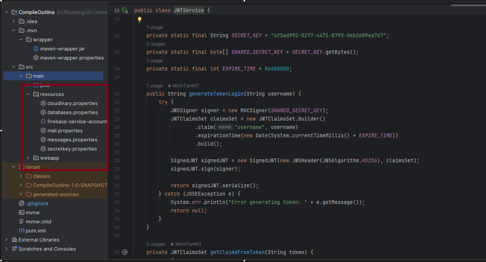
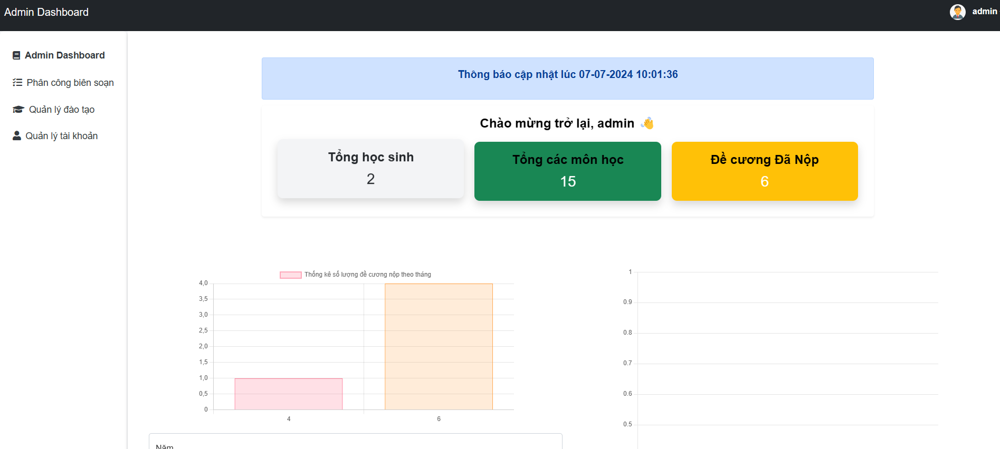
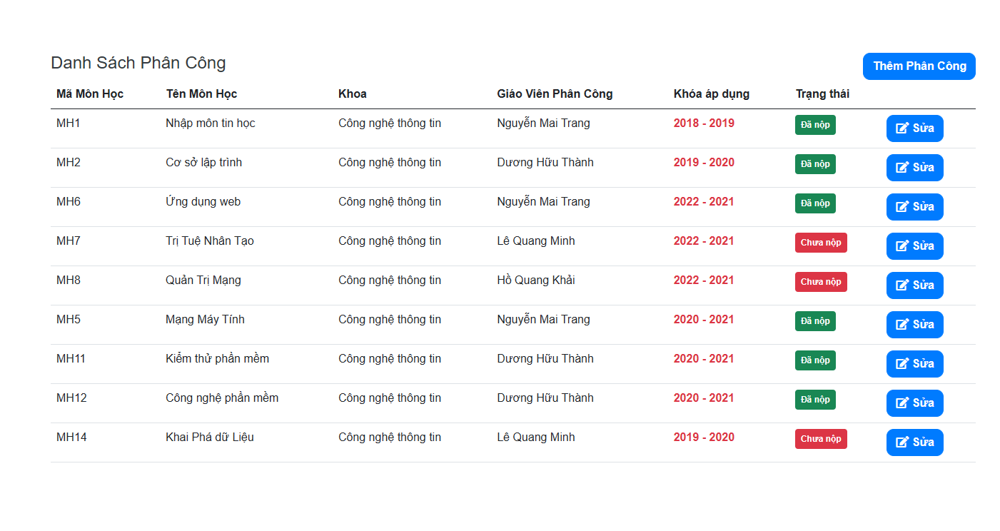
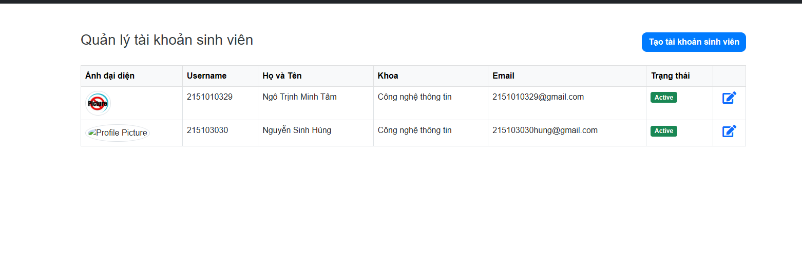
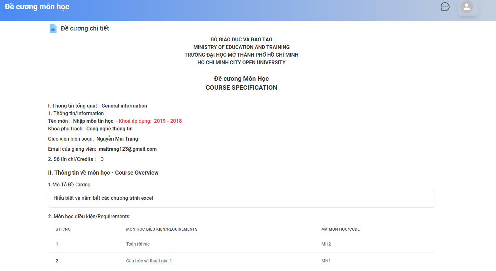
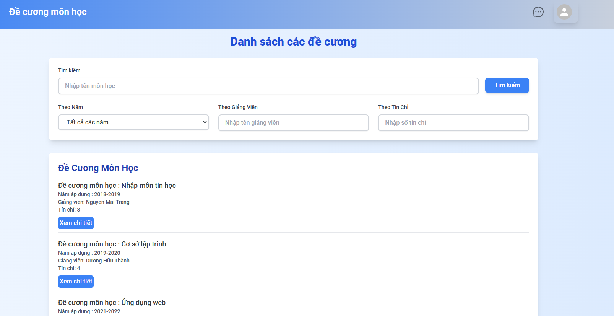

[](https://skillicons.dev)

# University Specifications App

This application allows students to read all university specifications, comment on them, and rate them based on their school-provided accounts. It aims to enhance student engagement and provide a platform for feedback on university policies, course details, event schedules, and more.

## Table of Contents

- [Features](#features)
- [Tech Stack](#tech-stack)
- [Setup and Installation](#setup-and-installation)
- [Configuration](#configuration)
- [Interface](#interface)
- [References](#references)

## Features

- **User Authentication and Authorization**:

  - Students can log in using their university-provided accounts.
  - Lecture account will be registered and after the admin active account the lecturer can log in
  - Role-based access control to ensure only authenticated users can comment and rate.

- **Specifications Management**:

  - View detailed university specifications, including course details, policies, and event schedules.

- **Commenting System**:

  - Add and delete comments on specifications.
  - View comments from other students to facilitate discussion and feedback.
  - Classify all the comments such as : positive,negative,neutral

- **Rating System**:
  - Rate specifications based on personal experiences and opinions.
  - View average ratings for each specification.
- **Admin site**:

  - Will be the stats all the specification was submitted the following month and quarter
  - And stats all the comments depending on the classify

## Tech Stack

**Frontend**:

- **HTML, CSS, JavaScript**
- **Libarary : React JS**
- **JSP (JavaServer Pages)**
- **Spring MVC for handling views and requests**

**Backend**:

- **Java**
- **Spring MVC**
- **Spring Security for authentication and authorization**
- **Hibernate for ORM (Object-Relational Mapping)**
- **MySQL for the database**

## Setup and Installation

**Frontend**:

**Clone the repository**:

```sh
git clone https://github.com/MinhTamNT/Compile_outline_FE.git
```

```sh
npm install
```

```sh
npm run dev
```

**Backend**:

```sh
git clone https://github.com/MinhTamNT/compile-outline-course.git
```

```sh
Build Project
```

- After build project you can start project by server Tomcat : https://tomcat.apache.org/download-90.cgi

- Open the folder project and after click on Edit configuration -> click on server tomcat and select folder you tomcat installed

## Configuration

Folder src/main/resoucers

- Create File cloudinary.properties

```bash
cloud_name=
api_key=
api_secret=
```

- Create file database.properties

```bash
hibernate.dialect=org.hibernate.dialect.MySQLDialect
hibernate.showSql=true
hibernate.connection.driverClass=com.mysql.cj.jdbc.Driver
hibernate.connection.url=jdbc:mysql://localhost:3306/name_db
hibernate.connection.username=username_my_sql
hibernate.connection.password=password_my_sql
```

- Create file mail.properties
- Get key : https://sendgrid.com/en-us

```bash
key = Send_GIRD_KEY
form_key = From_key
```

- Create file firebase-service-account.json
- Get key in firebase : https://firebase.google.com/

```bash
{
  "type": "",
  "project_id": "",
  "private_key_id": "",
  "private_key": "",
  "client_id": "",
  "auth_uri": "",
  "token_uri": "",
  "auth_provider_x509_cert_url": "",
  "client_x509_cert_url": "",
  "universe_domain": ""
}

```



- After open folder Text-classfiy by pyhcarm or ide tool
- with Pycharm
- You must install venv in setting -> project Text-classfiy -> python interperter -> select python version and create

- CMD

```bash
.\.venv\Scripts\activate
```

- Install all package

```bash
pip install -r requirements.txt
```

- Run project click right mouse -> select run project

## Interface

- Admin site





- User interface





## References

- Tailwind css : [Libarary Tailwind css](https://tailwindcss.com/)
- Mui core : [Libarary Mui Core](https://mui.com/material-ui/getting-started/)
